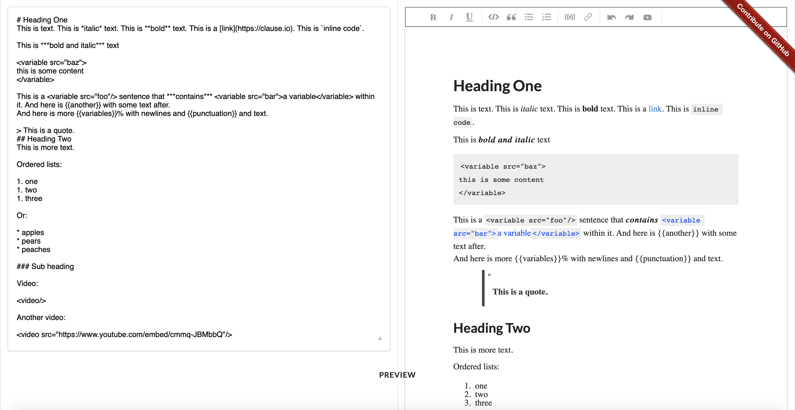
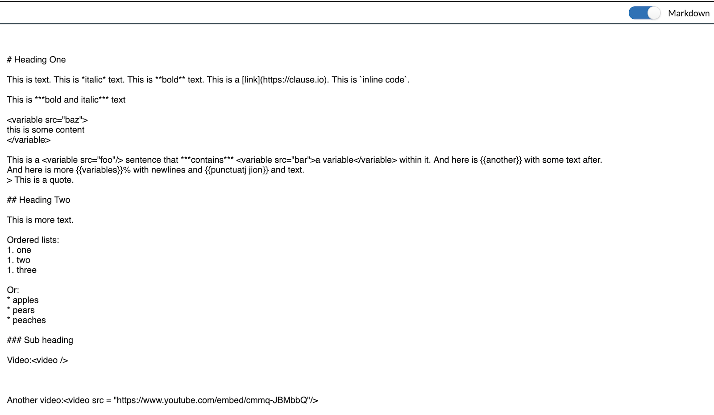

# Markdown Editor

[](https://app.netlify.com/sites/accordproject-markdown-editor/deploys) [](https://badge.fury.io/js/%40accordproject%2Fmarkdown-editor)

This is a React component for a rich text editor that can read and write [CommonMark](https://commonmark.org) Markdown text. The editor uses [Slate](https://docs.slatejs.org/).

The editor is plugin based and includes a static formatting toolbar.

This component is Apache-2 licensed Open Source. Contributors welcome!

### [Demo](https://accordproject-markdown-editor.netlify.com/examples/)

### Usage

```
npm install @accordproject/markdown-editor
```

```
import { MarkdownEditor } from '@accordproject/markdown-editor';
import List from '@accordproject/markdown-editor/dist/plugins/list';
import Video from '@accordproject/markdown-editor/dist/plugins/video';

const plugins = [List(), Video()];

function storeLocal(value, markdown) {
  // console.log(markdown);
  localStorage.setItem('markdown-editor', markdown);
}

const defaultMarkdown = '# Hello World.';

ReactDOM.render(<MarkdownEditor plugins={plugins} lockText={false} markdownMode={false} markdown={defaultMarkdown} onChange={storeLocal}/>
, document.getElementById('root'));
```

### Example

For an example React App see the `./examples/` folder.

A `TextArea` containing [CommonMark](https://commonmark.org) synchronized with a `MarkdownEditor` component, rendered using [Slate](https://docs.slatejs.org/).

The code for the sample `video` plugin used in the demo is here:
https://github.com/accordproject/markdown-editor/blob/master/src/plugins/video.js





Run `npm start` and then navigate to: http://localhost:3001/examples

## Available Scripts

In the project directory, you can run:

### `npm start`

Runs the app in the development mode.<br>
Open [http://localhost:3001/examples](http://localhost:3001/examples) to view it in the browser.

The page will reload if you make edits.<br>

### `npm run build`

Builds the app for production to the `build` folder.<br>
It correctly bundles React in production mode and optimizes the build for the best performance.

The build is minified and the filenames include the hashes.<br>
Your app is ready to be deployed!
